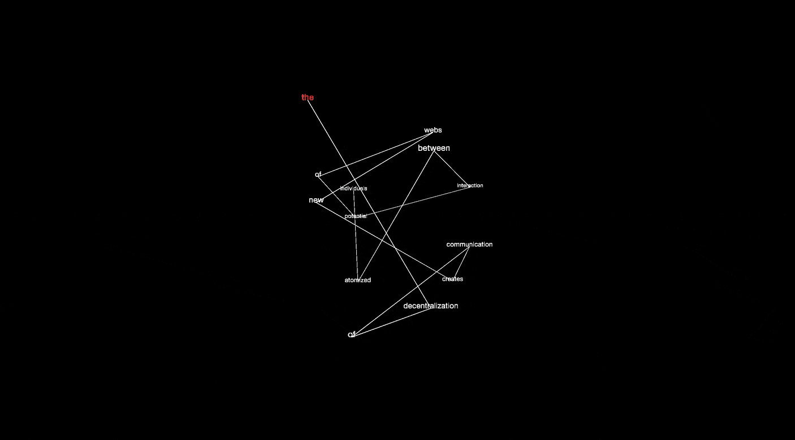

## Welcome to Finn's SKO for codeWords 2020.

SKO is seperated into weekly recaps / reflections. Click "Next Week" at the bottom of each page to move to the next entry.

[week 01 - Introductions](https://finnarundel.github.io/codewordsRMIT/week_01/)

[week 02 - Modular Typography](https://finnarundel.github.io/codewordsRMIT/week_02/)

[week 03 - Electronic Literature](https://finnarundel.github.io/codewordsRMIT/week_03/)

[week 04 - Pong](https://finnarundel.github.io/codewordsRMIT/week_04/)

[week 05 - House of Leaves](https://finnarundel.github.io/codewordsRMIT/week_05/)

[week 06 - Time and Space in the Age of Information](https://finnarundel.github.io/codewordsRMIT/week_06/)

[week 07 - Paper Prototypes and Pseudocode](https://finnarundel.github.io/codewordsRMIT/week_07/)

[week 08 - WEBGL](https://finnarundel.github.io/codewordsRMIT/week_08/)

[week 09 - It's Coding Time](https://finnarundel.github.io/codewordsRMIT/week_09/)

[week 10 - Professional Practice](https://finnarundel.github.io/codewordsRMIT/week_10/)

[week 11 - It's Coding Time, The Sequel](https://finnarundel.github.io/codewordsRMIT/week_11/)

[week 12 - Final Week](https://finnarundel.github.io/codewordsRMIT/week_12/)

[FINAL](https://finnarundel.github.io/codewordsRMIT/time_and_space/)
