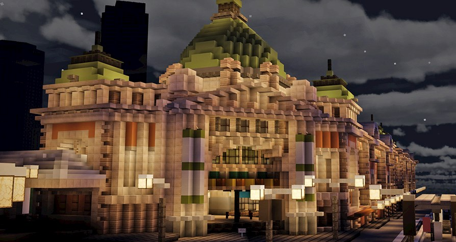

# Code~Words. Week 01
## Virtual Melbourne 
After starting the day with initial self-introductions and information about the course and it’s assignments, the whole class met in a virtual version of Melbourne on Minecraft to discuss how reading may be changing in digital space. 



## Proceessing
We were also introduced to coding through Processing and given a short introduction into the application and its features. Our task over the next week was to create the first letter of our names only utilising basic line, shape and colours.

```javascript 
function setup() {
createCanvas (500,500);
background(0,0,255);
}

function draw() {
strokeCap(SQUARE); 
stroke (0);
strokeWeight (40);

// drawing the F
line (50,100,50,400);
line (50,100,200,100);
line (50,250,200,250);

// drawing the A
line (300,100,300,400);
line (450,100,450,400);
line (300,100,450,100);
line (300,250,450,250);
}
```

