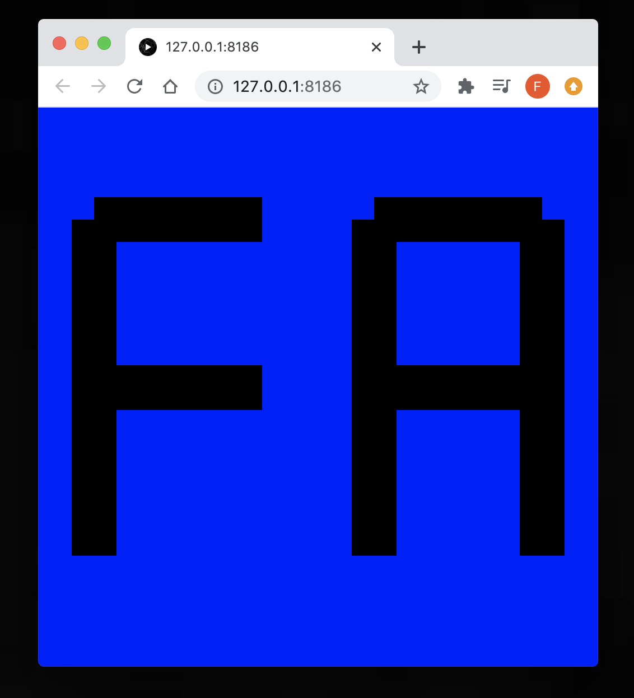

# code~words. week 01
## Virtual Melbourne 
After starting the day with initial self-introductions and information about the course and it’s assignments, the whole class met in a virtual version of Melbourne on Minecraft to discuss how reading may be changing in digital space. After my many, many years of crafting experience I was very excited for this, until Fergus burnt down my house I was building.


## Processing
We were also introduced to coding through Processing and given a short introduction into the application and its features. Our task over the next week was to create the first letter of our names only utilising basic line, shape and colours. For my initials I only used lines because thats all I knew how to use. Although I would definitely do it differently if I was to redo it, mainly using rectangles instead.

```javascript 
function setup() {
  createCanvas (500, 500);
  background(0, 0, 255);
}


function draw() {
  strokeCap(SQUARE); 
  stroke (0);
  strokeWeight (40);


  line (50, 100, 50, 400);
  line (50, 100, 200, 100);
  line (50, 250, 200, 250);

  line (300, 100, 300, 400);
  line (450, 100, 450, 400);
  line (300, 100, 450, 100);
  line (300, 250, 450, 250);
}
```


[Week 01 seminar slides](https://drive.google.com/drive/folders/1G21z95TwWmkE1V7Sd08cL_Sm7DSOokO3).

[Home Page](https://finnarundel.github.io/codewordsRMIT/)

[Next Week](https://finnarundel.github.io/codewordsRMIT/week_02/)
