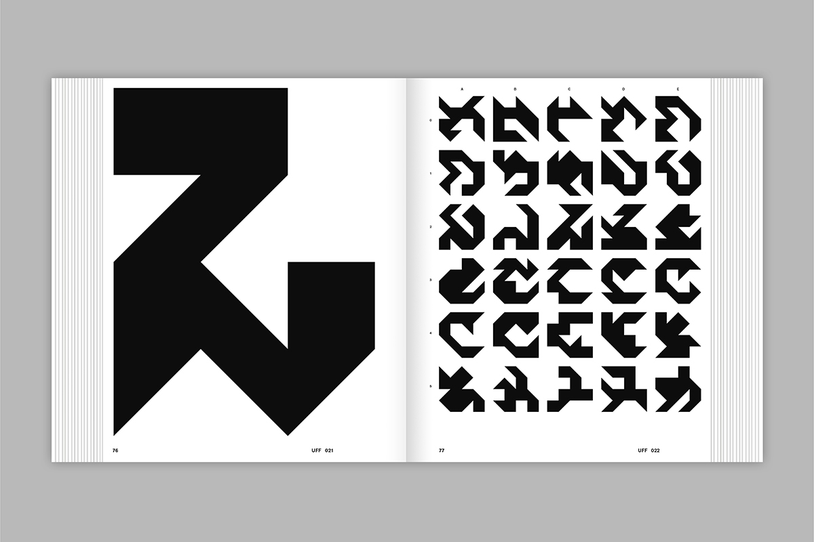
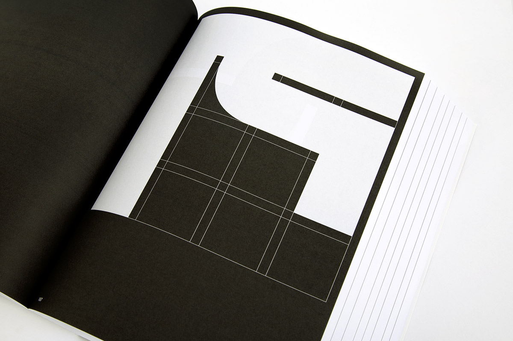

# code~words. week 02

## Modular Typography
This class began with a discussion on modular typography. The artists and designers that I found most interesting were Theo Van Doesburg and Jurriaan Schrofer with bold shape making up their type, as well as Mike Kelly with his similar but more modern shapes. After this each student gathered their own designer, I shared Jaanis Maroscheck and their book [Shape Grammar](https://www.slanted.de/product/shape-grammars/). Inspired by the work of Sol LeWitt, Maroscheck designs and programmes production systems for shapes and letters. 

 

## Processing
The last half of the session was dedicated to more Processing, were we shared our custom letters from the previous week. As well as an introduction to GitHub, where we each created a repository that will become our SKO. It was at this time that I began watching Processing tutorials by Daniel Shiffman ([The Coding Train](https://www.youtube.com/c/TheCodingTrain/featured) on YouTube). 

## First Assignment // Second Life
Returning to our first assignment, we were tasked to reinterpret a portion of the novel House of Leaves by Mark Z. Danielewski, in a virtual gaming world of our choosing. This assignment allowed for the experimentation and exploration of language and reading in digital space, my group chose [Second Life](https://secondlife.com/). Over the coming weeks we were to discuss in our group of four how to best interpret the book for our virtual space. 

 

Link to [modular typography slides](https://docs.google.com/presentation/d/1N2hAFp6si7UsVuPj1oMQ21_HHF858NbXZna0YQxOQio/edit#slide=id.p).

[Home Page](https://finnarundel.github.io/codewordsRMIT/)
[Next Week](https://finnarundel.github.io/codewordsRMIT/week_03/)
