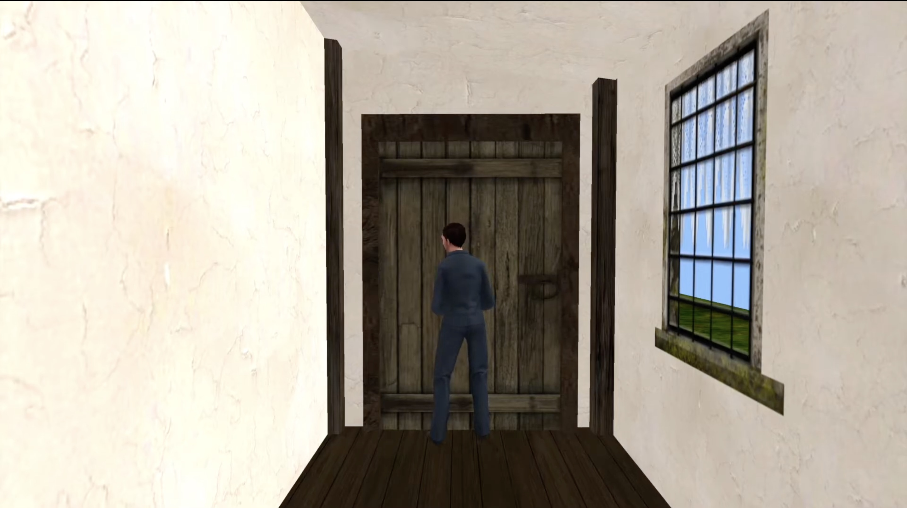
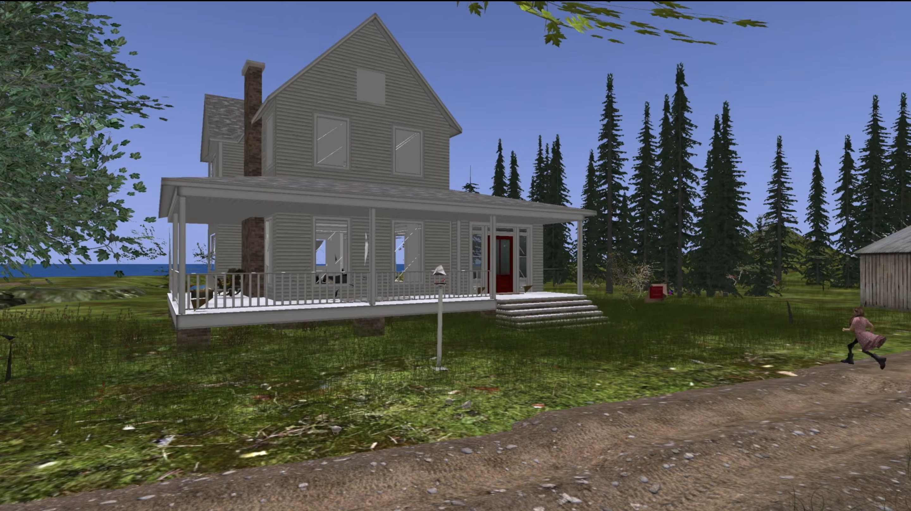
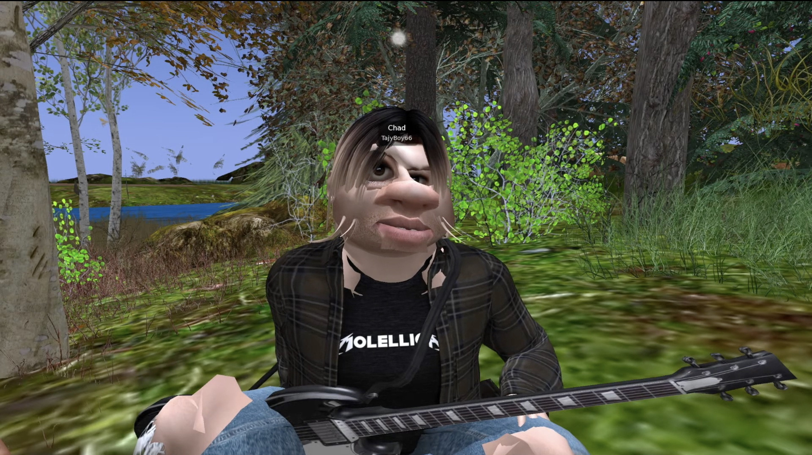
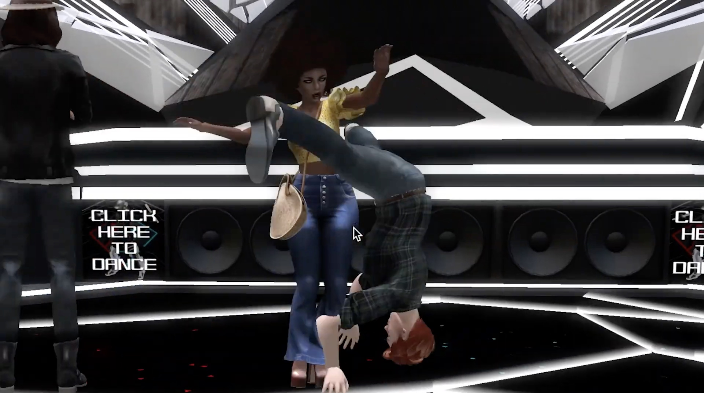

# code~words. week 5

In class we presented our assignment one videos. We interpreted the first and second passage of the book in Second Life.
[Our YouTube video](https://www.youtube.com/watch?v=KQGvEqaG5Ro&t=31s)

Second Life worked well as a way to interpret the text into a digital space, mainly as it had a certain uncanny feeling about it which lent itself to the horror feel especially of the first passage. Avatar customisation and camera controls also played well with the re-telling, however we were limited to pre-made environments as we couldn’t create structures like in other games like Minecraft, this limited us slightly.

[Home Page](https://finnarundel.github.io/codewordsRMIT/)

[Next Week](https://finnarundel.github.io/codewordsRMIT/week_06/)
