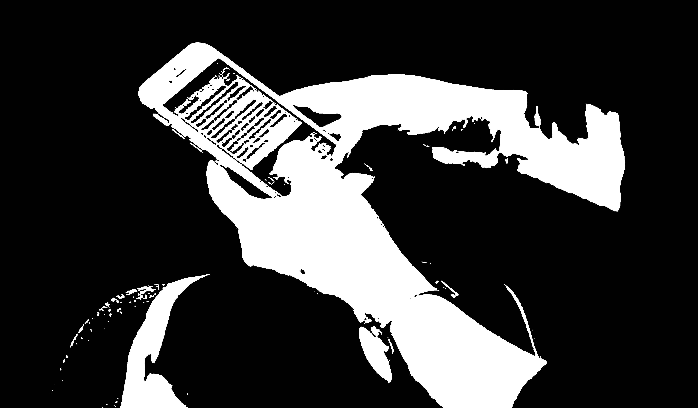
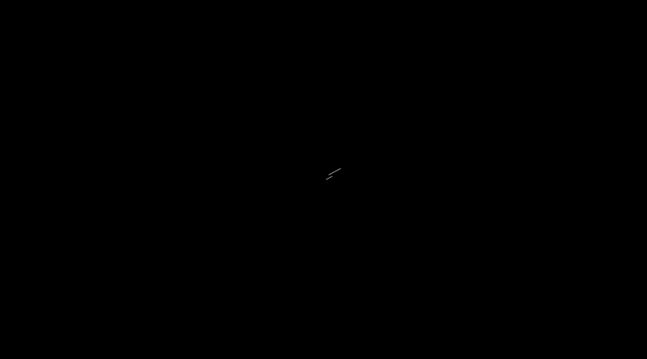

# code~words. week 06

# On the move: technology, mobility, and the mediation of social time and space. By Nicola Green

For the major assignment we will research, develop, code and publish a digital version of a critical text on art and language. After reading a number of texts I ended up choosing a section from [*Time and Space in the Age of Information*](http://digbeyond.com/readme/view.php?id=101&course=Code%20Words) by Nicola Green titled *On the move: technology, mobility, and the mediation of social time and space*. 

Robert Hassan writes "Nicola Green brings us up to the present with her essay ‘On the move: technology, mobility, and the mediation of social time and space’, which looks at the experience of time and space through the use of that most ubiquitous of new media technologies, the mobile phone. Green’s work is important because it recognizes a unique convergence of technology use within time and space. For Green, the act of being ‘mobile’ and communicating across time and space represents a qualitatively different experience from that of other media technologies such as the telegraph, or television or the inter- net, where users are required, usually, to be fixed in space. Using qualitative data gathered from the experience of users themselves, she asks the crucial question: what does it mean to be mobile in a mobile world?"  Hassan R, 2002, The New Media Theory Reader, Page 222.

I chose this text because I find the effects of the internet and mobile technology has had on life and communication very interesting. This new technology allows individuals to freely and quickly interact, and has created a world in which I am able to talk to someone on the other side of the world instantly. The "compression" of time and space is a result of this.

Out of the text I have chosen the following passage to base my assignment around:
> “The decentralization of communication creates new webs of potential interaction between atomized individuals, which on the one hand increases the communication activities carried out, while at the same time fragmenting that communication into more numerous communications of shorter duration.”

> "Time and space both become abstractions and cease to have meaning or value in themselves."

I think this passage works well to capture what I find most interesting as well as mentioning the metaphoric "webs of potential interaction" which I think I will use in my assignment.

# Experimenting with sine waves
After Karen showed us how to use sine waves in class, I made this after being inspired by this [video](https://www.youtube.com/watch?v=LaarVR1AOvs&list=LLYidLCp9CKTWbc-1Kaf_s_Q&index=20&t=813s). The animation works by connecting a different points of sine waves together with a line, while loading a black background each draw function with a small amount of alpha to get the fade effect. You can view it in full [here](https://finnarundel.github.io/codewordsRMIT/week_06/sine_waves/).

[Home Page](https://finnarundel.github.io/codewordsRMIT/)

[Next Week](https://finnarundel.github.io/codewordsRMIT/week_07/)
