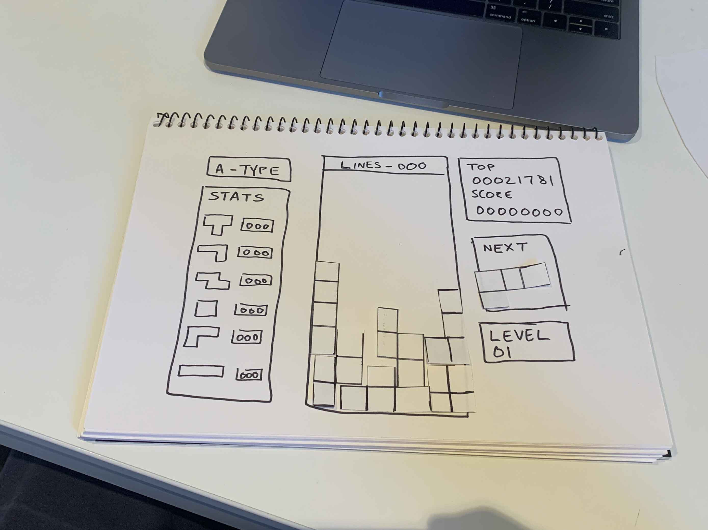
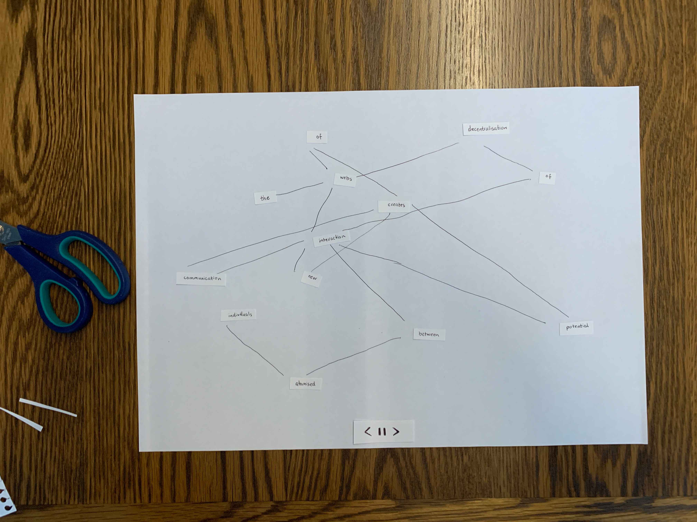
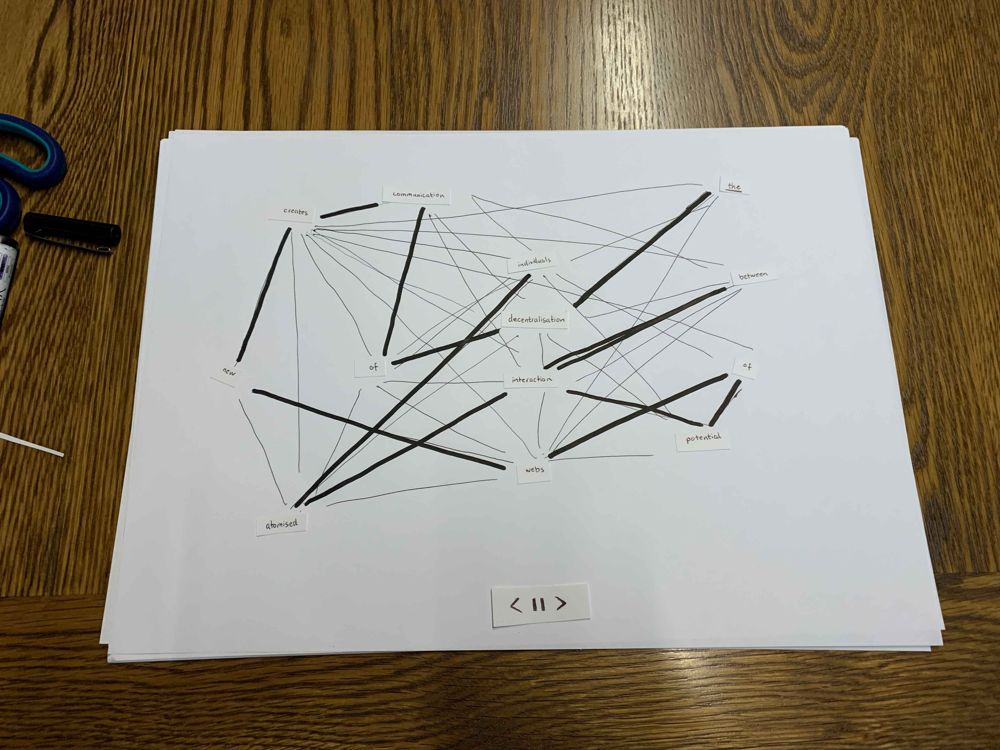

# code~words week 7.

## Paper Prototype
In class in week 6 we went through what a paper prototype is and how we'll be using it for our major project. We were asked to create a simple paper prototype of a arcade game, which allows us to understand its basic funtions. With my group I made a prototype for Tetris, creating the basic shapes and layout of the game.



## Major Assignment Paper Prototype
My idea for my major assignment is to seperate my text into its individual words and randomise their location on the canvas but have them each connected with a line in order to create a "web" of lines around the canvas. I aim to have these individual words floating around the canvas bouncing off of the walls. This "web" is in reference to the *"new webs of potential interaction between atomized individuals" created in the age of information"*. This visual web of lines also is in reference to the *World Wide Web*, a new technology that has lead to the compression of space and time as mentioned by Nicola Green.

In reference to literature, the layout of the typography challenges our usual way of reading (left to right) and makes us rely on the connecting line to give a  meaning to the words.



For the prototype I cut out individual words which I placed randomly on the page, then with pen I connected them in order to create a readable sentence. At the bottom of the canvas I have three buttons that will: go to the previous phrase, pause the animation, and go to the next phrase. The text will be split into smaller phrases because it would be too difficult to read all the words at once. In the second versions I have each word connected to multiple words instead of just one, this the sentence line in bold.



## Pseudocode
In the second half of the class in week 6 we learnt about pseudocode and how we will use it for our major project. Pseudocode is an informal high-level description of a computer program or algorithm. It is written in symbolic code which must be translated into a programming language before it can be executed. Using this method we were made to describe an activity we might do everyday, I wrote instuctions on how to cook a hashbrown.

``` 
START
IF burner is off
  THEN turn burner on and place pan on burner

IF pan is hot
  THEN pour oil in pan

IF oil is hot
  THEN place hash-brown in pan

WHILE hash-brown in pan
  CHECK if underneath is cooked
  FLIP

WHILE hash-brown in pan
  CHECK if top is cooked

ENDIF 
```
For my main assignment I have also written some basic pseudocode.

```
major 
  project
  
pseudocode

```
