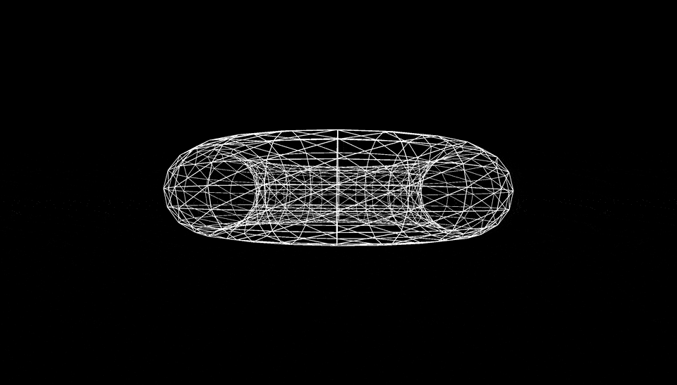
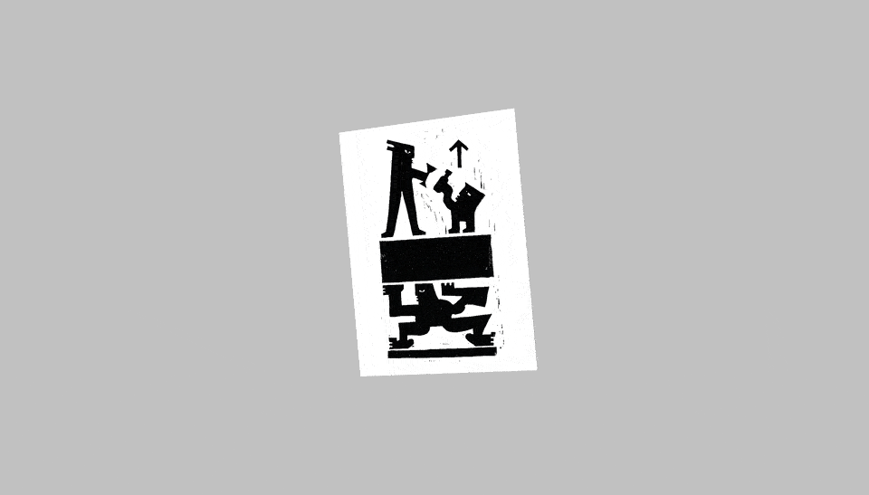
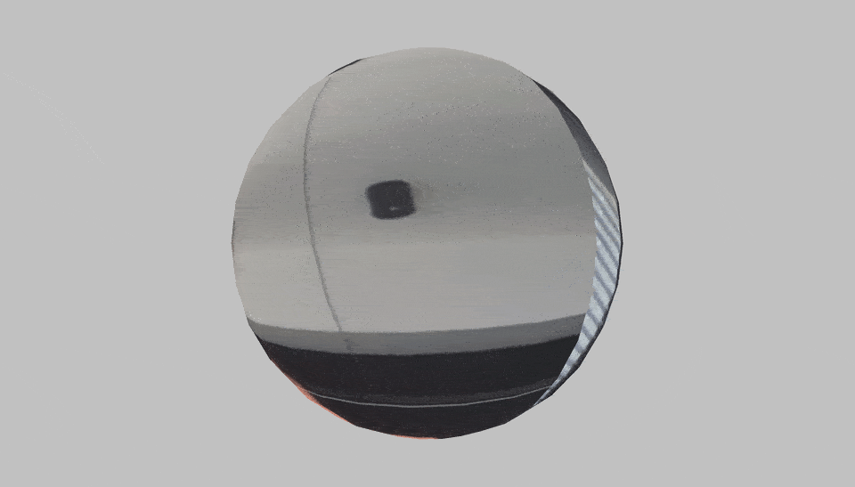

# code~words week 08.

## Major Assignment

Lots of coding this week trying to work towards the major assignment. I experimented with different methods and libraries I might need in order to accomplish my idea. Here is my final pseudu code, I'll be using it to work through the assignment

```
IMPORT text and music
SPLIT into individual words

START 3D SPACE

PLAY music

IF word = first word
  THEN colour red

DISPLAY words randomly on canvas (X,Y and Z) 
IF overlap between words
  THEN retry word position
PLAY sound when each word is displayed
CONNECT words with line in sentence order

ROTATE around Y axis 

WHEN mouse is dragged rotate around Y axis according to mouseX
 
FUNCTION next
  IF next button is pressed
  THEN display and connect next sentence
  
FUNCTION previous
  IF previous button is pressed
  THEN display previous sentence

FUNCTION reload
  IF reload button is pressed
  THEN reload current sentence display
  
SLIDER time & space
  IF slider is dragged left 
  THEN reduce range
  IF slider is dragged to the right
  THEN increase range 
  
ENDIF
```
For the 3d element of the assignment I have been experimenting with WEBGL, which is an inbuilt library in p5.js. This add the possibility to use a Z axis in the sketch. 




