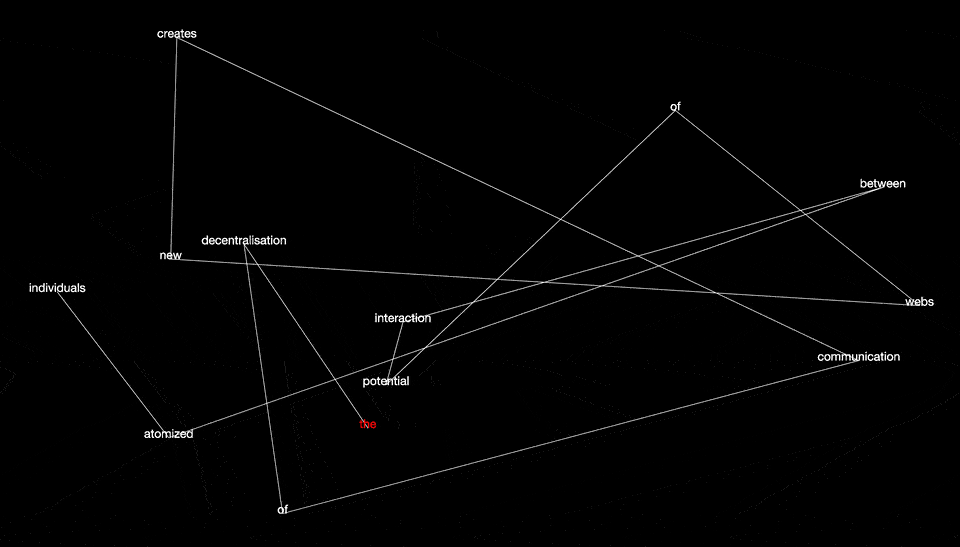

# code~words. week 09.

## Beginning Sketch
In class with week we seperated outselves into groups and had time to work on our major assignments for the majority of the class. At the start of the day I had this sketch.

``` javascript
let node = [];
var sentence = " the decentralisation of communication creates new webs of potential interaction between atomized individuals";

var words = sentence.split(" ");


function setup() {
  createCanvas (windowWidth, windowHeight);
  for ( let i = 0; i < words.length; i++) {
    node[i] = new NodePoint (random(50, width-50), random (50, height-50));
  }
}

function draw() {
  background (0);
  for ( let i = 0; i < node.length; i++) {
    node[i].show(); // uses draw counter as arguement for class
  }
}

class NodePoint {
  constructor (x, y) {
    this.x = x;
    this.y = y;
  }
  
  show (count) {
    for (var i = 0; i < words.length; i++) {
      textAlign (CENTER);
      textSize (16);
      noStroke();
      fill (255);
      text(words[i], this.x, this.y);
    }
  }
}
```


My plan for the day was it figure out a way to seperate the type so it wasn't stacked on top of each other, as well as connecting a line word to word in sentence order. 

## Seperating Words
Took me a long time to figure out how to stop the words from stacking on top of each other but while I was eating lunch, taking a break from my code I finally figured it out. I ended up using the counter (i) from the draw for loop as an argument in the node class. This way, only one part of the string is used for each node rather than using all words.

``` javascript

for ( let i = 0; i < node.length; i++) {
  node[i].show(i); 
   
class NodePoint {
  constructor (x, y) {
    this.x = x;
    this.y = y;
  }

  show (count) {
    for (var i = 0; i < words.length; i++) {

      textAlign (CENTER);
      textFont (helvetica);
      textSize (18);
      noStroke();
      text(words[count], this.x, this.y);
    }
  }
}
```

## Connecting Line
In order to get the line connecting the words together I actually need to have mulitple lines going from the current word to the next. In order to accomplish this I needed to use the for loop again.

```javascript
for ( let i = 0; i < node.length; i++) {
  node[i].show(i); 
  line (node[i].x, node[i].y, node[i + 1].x, node[i + 1].y);
}
```

## First Word Red
In order to make the sentence more readable I needed to make the first word contrast the others so it would be easier to find. In order to achieve this I wanted to make the first word red to contrast the black background and other white words. This also took me a while to figure out, at first I tried to change the word to red if it equaled to "the". This worked however, when the other sentences I intend to use are loaded in it won't. I ended up doing this, utilising the "count" variable I established in the NodePoint class.

``` javascript
if (count == 0) {
  fill (255, 0, 0);
  } else {
  fill (255);
}
```

## Overlap 
In testing the code I discovered the issue that sometimes the words generate too close together, making the sentence illegible. To fix this I wanted to create a feature that would only generate the words to the screen if there was enough distance between the words. This [tutorial](https://www.youtube.com/watch?v=XATr_jdh-44) was helpful in learning the dist() function which I needed to figure out the distance between the nodes. This [sketch](https://www.openprocessing.org/sketch/28023) was helpful I figuring out a way in which one word could communicate to all the other words. This [tutorial](https://www.youtube.com/watch?v=lm8Y8TD4CTM&t=206s) was helpful in figuring out a way I could reset the sketch if there was an overlap. Ultimately combining all these different elements, I wrote this.

``` javascript
let overlapping = false; 

for ( let i = 0; i < node.length; i++) {
  for (j=0; j < node.length; j++) {
    if (j != i) { // j equals every other node apart from the current i
      let d = dist(node[i].x, node[i].y, node[j].x, node[j].y);
      if (d < 50) {
        overlapping = true;
      }
    }
  }
}

if (overlapping == false) { // makes it so nothing generates when overlapping == true
  for ( let i = 0; i < node.length; i++) {
    node[i].show(i); 
    stroke (255);
    line (node[i].x, node[i].y, node[i + 1].x, node[i + 1].y); 
    node[i].show(i); 
  }
} else {
  resetSketch();
}
}

function resetSketch () { // if overlap = true then reset function runs
for ( let i = 0; i < words.length; i++) {
  node[i] = new NodePoint (random(50, width-50), random (50, height-50));
}
}
```
## End of day / Issues
At the end of the day I had the below sketch. One problem I've encountered with this version is that the line () function stop the frameCount. I've played around a bit by puting this function in the class itself, however this doesn't solve the problem. I need frameCount in the future when I add animation, buttons and sliders for interactivity. Goals for the following week is to accept to fix this problem and start to bring this sketch into a 3D enviroment in WEBGL.


