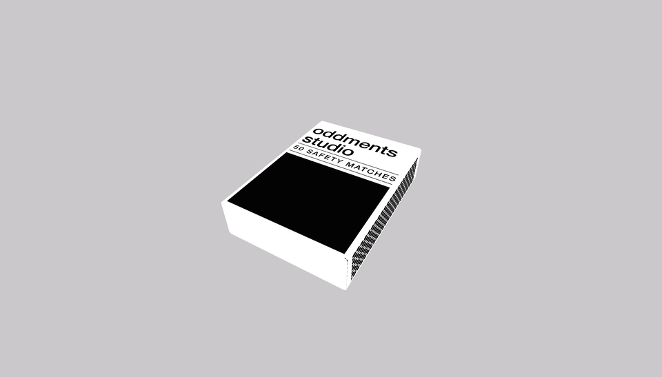

# code~words week 10

## Professional Practice
In my Communication Design Professional Pratice class one of our assignments was to design a creative representation for our own future design practice, as well as three promotional items for that practice. Inspired by this studio I based my practice's style and items around the combination of analogue and digital technologies, utilising some of the skills I've learnt in this class. 

For the assignment I created a matchbox, a virtual gallery and a poster I created in Processing, signifying old, new and a combiniation of technologies. I used blender to create the [matchbox model](https://finnarundel.github.io/codewordsRMIT/week_10/matchbox_presentation/) which I then loaded into Processing using p5.EasyCam to move around it. For the [virtual gallery](https://connect.unity.com/mg/other/untitled-31948), I used Unity. For the [posters](codewordsRMIT/week_10/poster_presentation/) I created a [sketch](https://github.com/FinnArundel/codewordsRMIT/blob/master/week_10/prof_prac_posters_02/prof_prac_posters_02.js) where images were randomised onto the page, with no overlap, then had a refresh and save function running to save the many variations.




## Major Assignment
At the end of last week I had a working 2D sketch which randomised positions of words and connected these words in sentence order. This week I planned to add timing and sounds to the sketch as well as make it 3D. Using a if function in my for loops I was able to time the generation of the node points in relation to the frameCount, like so:

``` javascript

for ( let i = 0; i < words.length; i++) {  
  if (frameCount > 50 * i + 50) {
    node[i].show(i); 
  }
}

```
I could then easily add in a sound to play whenever it equals the same period of time

``` javascript
for (let i = 0; i < words.length; i++) {
    if (frameCount === this.time * i + this.time) {
  sound.play();
  }
}
```
[Timed sketch](https://finnarundel.github.io/codewordsRMIT/week_10/timing_sound_wip/)


Creating a 3D enviroment instead of the 3D space I had was actually quite simple. Using WEBGL, all I had to change was how I choose the location of the words. Creating a this.z variable allowed me to use the translate function to position the text in the 3D enviroment, I learnt this by working on my posters for Prof Prac.

``` javascript
push();
translate (this.x, this.y, this.z);
text(words[count], 0, 0);
pop();
```


