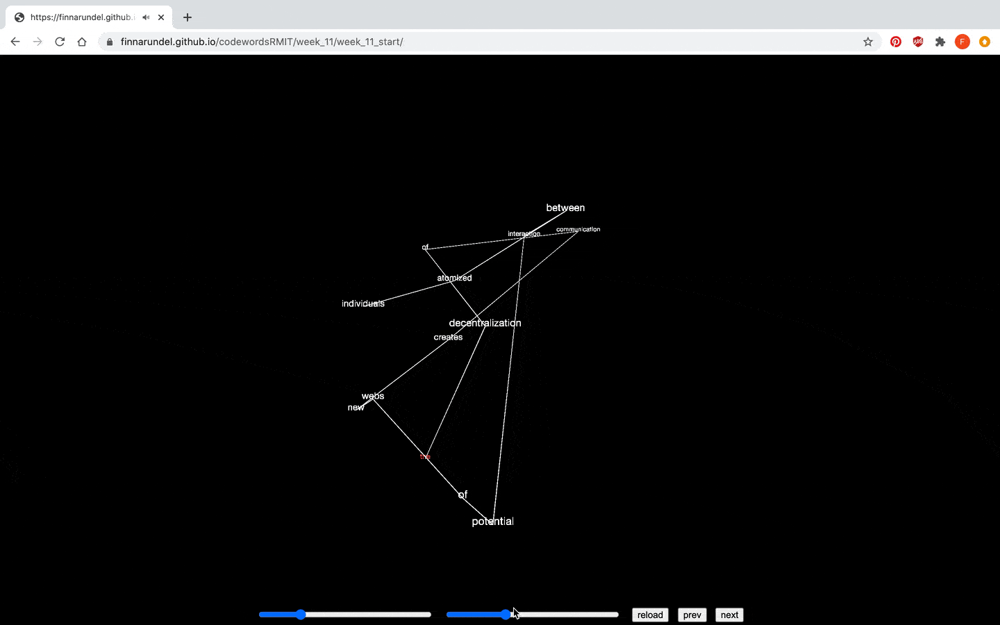
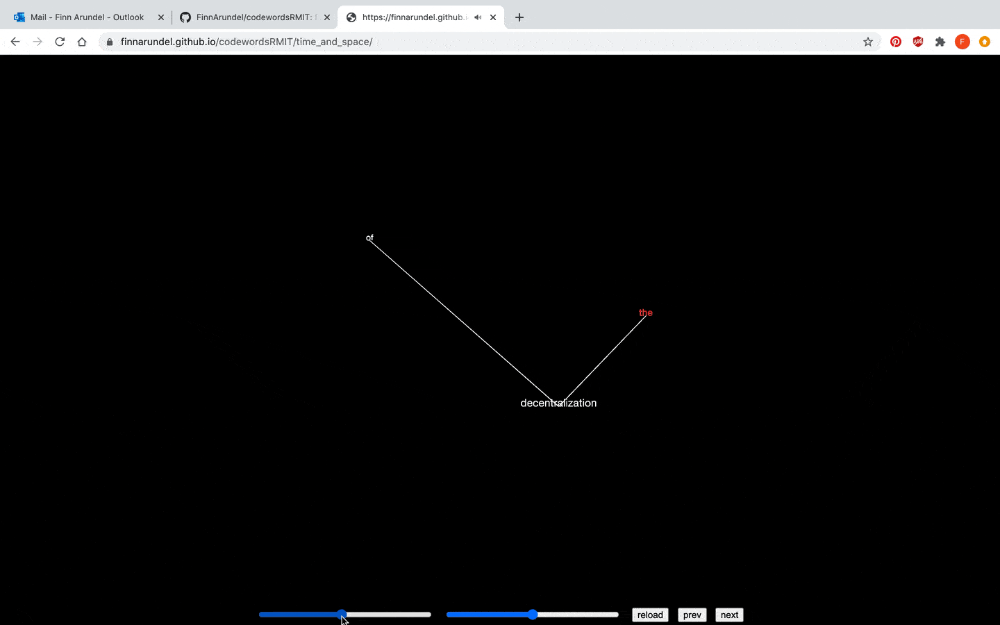

# code~words week 11
## Interation
For my work I wanted to add some controls for interation. From my paper prototype I wanted to add buttons to cycle through the different sentences, a reload button, and a slider to change the distance of the node points from the centre. I later decided to add a slider which will dictate the speed of the node's generation.

## Buttons
For the buttons I had to create a function which would delete and create new node points. After some help from Karen (thank you), I created a function that achieved this. It works by 'flushing' the node and words variables, which will allow a new sentence to be displayed.
``` javascript


function resetSketch () {
  node = [];
  words = sentences[index].split(" ");

  frameCount = 0;

  for ( let i = 0; i < words.length; i++) {
    let size = height/4;
    wdt = int(random(-size, size));
    hgt = int(random (-size, size));
    z = int(random (-size, size));
    node[i] = new NodePoint (wdt, hgt, z, timeSlider.value());
  }
}
```
For the 'next' and 'prev' buttons, I had to create a new function which would increase the value of a variable which would in turn move through the different sentences. I achieved this through the code below. I then added two DOM element buttons, which ran the functions when pressed.

``` javascript
let sentence0 = "the decentralization of communication creates new webs of potential interaction between atomized individuals"; 
let sentence1 = "which on the one hand increases the communication activities carried out";
let sentence2 = "while at the same time fragmenting that communication into more numerous communications of shorter duration"; 
let sentence3 = "time and space both become abstractions and cease to have meaning or value in themselves";
let sentences = [sentence0, sentence1, sentence2, sentence3];

let index = 0;
let words = sentences[0].split(" ");

function nextSentence () {
  if (index < 3) {
    index ++;
    resetSketch();
  }
}
```
## Sliders
Surprisingly the sliders were actually the most challenging part of the whole work. The slider that adjucted the timing was slightly easier. I created a variable inside the class constructor (this.time) that took the slider's value, and moved most of the timed elements of the sketch inside the class itself. This allowed the slider to work only when the nodes are first created rather than constantly updating, revealing and concealing words when moved. I also made it so when the slider is released the resetSketch function plays, so theres an immediate reaction to your use of the slider.
``` javascript
timeSlider = createSlider(0, 100, 50);
timeSlider.position(width/2 - 350, height -25);
timeSlider.style('width', '250');
timeSlider.mouseReleased(resetSketch);
  
node[i] = new NodePoint (wdt, hgt, z, timeSlider.value());
```


The slider to adjust the location of the words was more difficult, but ended up having a pretty simple solution. In [previous attempts](https://finnarundel.github.io/codewordsRMIT/week_11/week_11_start/) to get this slider working I had the slider value (between 0 and 3) divide from this.x, this.y, and this.z. Doing it this way caused the coordinates to exponentially decrease or increase in size until the number be too large or too small to work. To fix this I saved the initial coordinates in the class' constructor with this.initialX = x, etc, and created another function inside the class to scale the points. This way, this.x doesn't multiple with itself.
``` javascript
scale () {
  this.x = this.initialX * spaceSlider.value(); 
  this.y = this.initialY * spaceSlider.value();
  this.z = this.initialZ * spaceSlider.value(); 
  }
```


