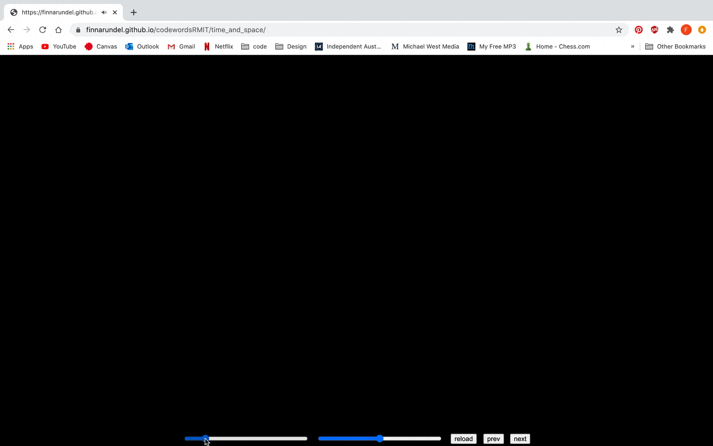

# code~words week 12.

## Final
Here's my [final work](https://finnarundel.github.io/codewordsRMIT/time_and_space/). In the final class we went through the [website](https://simandy.github.io/codewords/) Karen and Andy made showcasing all the students works. It was really fun to see all the cool stuff all the other students have been working on this semester.

## Reflection
I've really enjoyed this studio. Learning code and how to apply it to design has opened some new doors in my mind about the future of design and my own career. With zero previous coding experience I loved learning a new skill and critically applying it to my assignment, it made me use part of my brain I haven't used much since school. Personally exploring language and communication in my own project was really fun. I really enjoyed the theoretical conversations we had in our classes.

This studio has really changed how I think about my own future with design and encouraged me to embrace new technologies. I’ve become very interested in the potential of creative coding with my own design. In a very competitive design industry I think having the ability to use these new technologies like coding with help me enormously.

I hope to continue with some personal coding projects over the break, I'm interested in looking into some audio-visual stuff for live music next. 

Thanks Andy and Karen! Definitely my favourite class so far in the whole course, hope to do more like it in my final year (typography one sounded cool).
